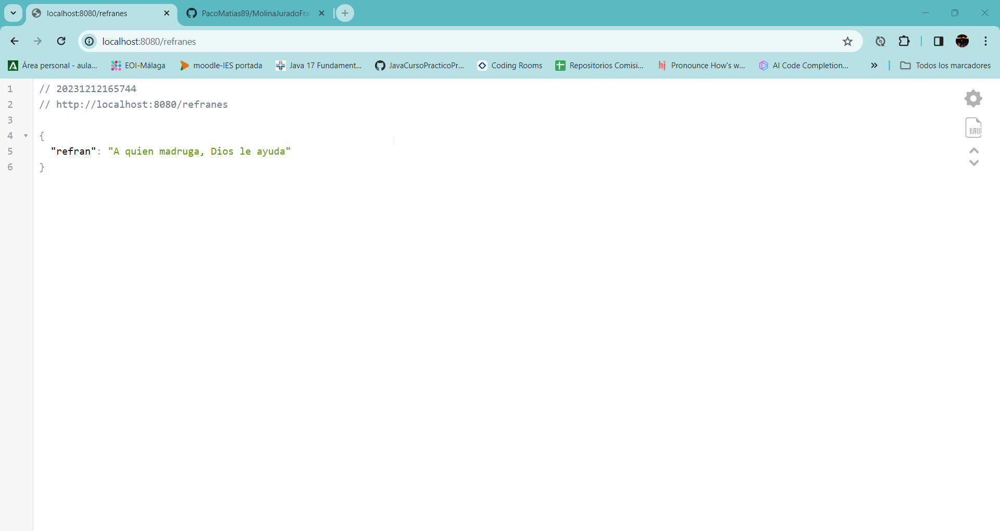

# Ejercicio N.º 1: Generador de refranes

Crear un programa que, al acceder a localhost:8080 a través de un navegador mediante el métoido GET, devuelva un refrán aleatorio de una lista predefinida. Por ejemplo: “No hay mal que por bien no venga”, “Al que madruga Dios lo ayuda”, etc.

## Funcionalidad del ejercicio

La idea de este ejercicio es crear un refranero aleatorio, es decir, a través de un model llamado Refrán donde lo creamos, para ello
usamos una lista en nuestro controlador, en el cual creamos una pequeña APIs Rest para que cuando abramos en el navegador _localhost:8080/refranes_ no devuelva un json
con la devolución de refrán aleatorio.
