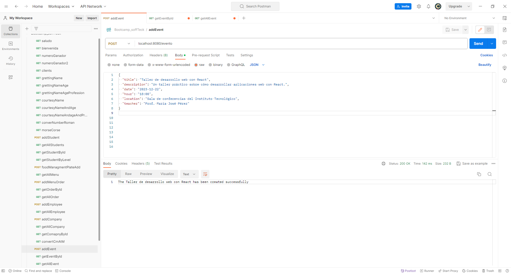
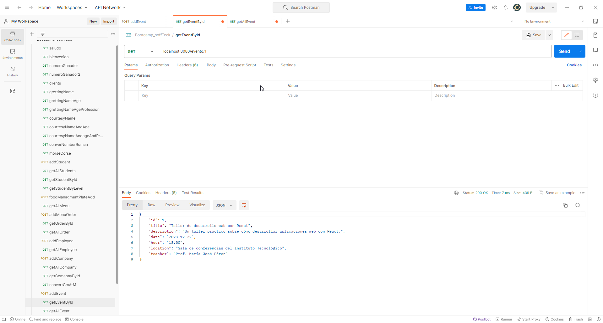
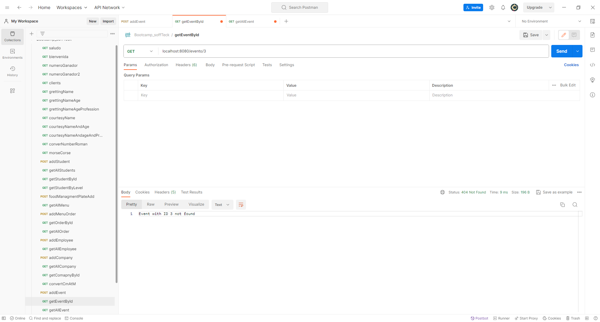
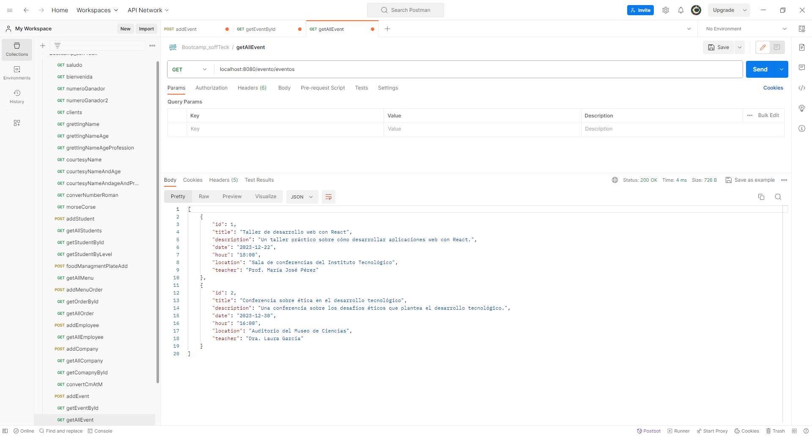

# Ejercicio Nº 1: Plataforma de Gestión de Eventos Académicos

## Enunciado
Estás desarrollando una plataforma para la gestión de eventos académicos en una universidad. El objetivo es crear una API RESTful utilizando Java con Spring Boot que permita a los usuarios ver eventos próximos, registrar nuevos eventos, inscribir participantes en eventos y obtener detalles específicos de un evento.

Para lograrlo, se requiere implementar los siguientes endpoints:

GET /eventos: Devuelve una lista de todos los eventos académicos próximos.

GET /evento/{id}: Obtiene información detallada de un evento específico mediante su ID.

POST /evento: Permite a los usuarios crear un nuevo evento académico y almacenarlo en una lista.

💡Nota: Utilizar como base de datos una Collection a elección para evitar todavía la configuración de Bases de Datos.

Una vez implementados los endpoints, lleva a cabo pruebas con Postman para verificar que cada uno funcione correctamente. Al finalizar, exporta la colección de Postman que contiene las pruebas realizadas.

## Funcionalidad
Como bien dice en el enunciado del ejercicio, se trata de una pequeña app para crear y visualizar eventos por varios métodos (id y todos)
de una universidad

### Método POST

Este método lo usamos para la creación del evento mediante la app _Postman_

### Método GET by ID
Éste método lo usamos para buscar eventos por el id del mismo

Y si en el caso de que el id no exista:

### Método GET
En este caso lo que vamos a obtener son todos los eventos
